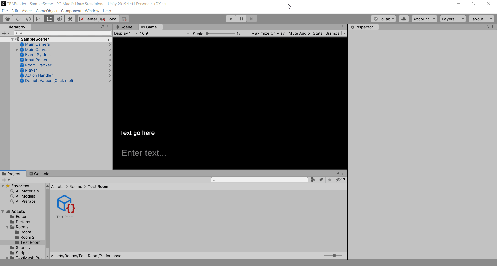

# Pops-TBA-Builder
Pop's Text Based Adventure Builder is a text based adventure creator where you don't have to edit a single line of code!

This project values simplicity without sacrificing power and customizability. You can create the game's logic, edit responses, flavor texts, and create an entire story 
by using a simple interface created in Unity's inspector. No programming experience or awkward syntax management needed!

As a Unity template, you can edit the visuals, change the code, or build around the template to create your own thing. Once your done, you can use Unity's build settings to
 export the game to easily share it with people!
 

